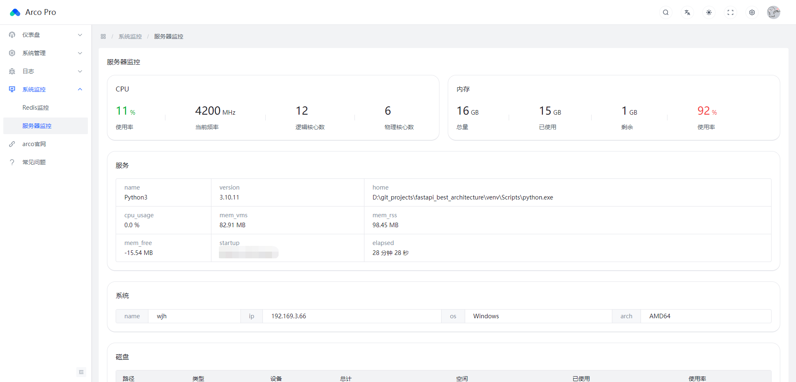

# FastAPI Best Architecture UI

Front-end Implementation of
the [FastAPI Best Architecture](https://github.com/fastapi-practices/fastapi_best_architecture)

Some basic functionality has been implemented, development has been slow. Fortunately, we now have a demo
site: [FBA UI](https://fba.xwboy.top/)

> [!CAUTION]
> Please keep in mind that at the moment it is only intended as a demo of the effect and not for production!

> [!NOTE]
> Use casbin authorization internally instead of role menu authorization

## Run

```shell
yarn install
yarn dev
```

## Build

```shell
yarn build
```

## Screenshots

<table>
  <tr>
    <td></td>
    <td></td>
  </tr>
  <tr>
    <td></td>
    <td></td>
  </tr>
  <tr>
    <td></td>
    <td></td>
  </tr>
  <tr>
    <td></td>
    <td></td>
  </tr>
  <tr>
    <td></td>
  </tr>
</table>

## Contributors

<a href="https://github.com/fastapi-practices/fastapi_best_architecture_ui/graphs/contributors">
  
</a>

## Special thanks

- [Vue.js](https://cn.vuejs.org/guide/introduction.html)
- [Arco-design-vue](https://github.com/arco-design)
- ...

## Sponsor us

If this program has helped you, you can sponsor us with some coffee
beans: [:coffee: Sponsor :coffee:](https://wu-clan.github.io/sponsor/)

## License

This project is licensed under the terms of
the [MIT](https://github.com/fastapi-practices/fastapi_best_architecture_ui/blob/master/LICENSE) license
